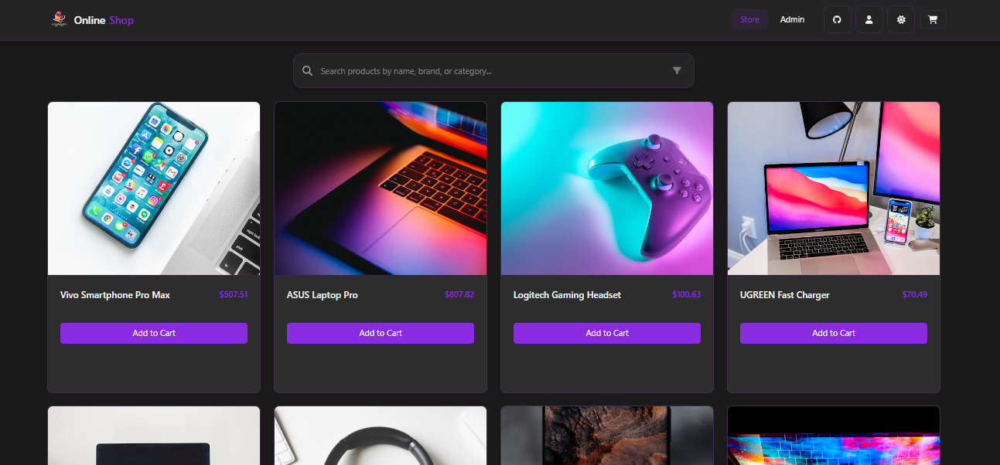

<<<<<<< HEAD
[)](https://github.com/pritam029)

Welcome to the **Online Shop** project . This repository contains a fully functional e-commerce application built to demonstrate foundational DevOps skills in three key areas:

- **Git & GitHub**
- **Linux**
- **Docker**

In this phase, your focus is on understanding the provided developer code, reviewing how these core topics are implemented, and making any necessary enhancements. When you're ready, you'll submit your work via our designated Google Form.

---

### Run in vs code
in terminal - "npm install --save-dev vite"
npm start
choose any link

### Project Details

### Content

- [**Situation**](#situation)
- [**Task**](#task)
- [**Action**](#action)
- [**Result**](#result--resume)

## Getting Started

1. Home Page

1. Admin Page

## Guidelines & Resources

Before diving into the tasks, please review the following key resources:

- [CONTRIBUTING.md](CONTRIBUTING.md): Guidelines for code contributions, commit messages, and overall coding standards.
- [COMMANDS.md](): Command used by me throught the project from Configuration to Deployment. `Except Git Commands`
- [ROADMAP.md](ROADMAP.md): Insights into the project vision, future enhancements, and milestones.
- **Repository Documentation:** Explore the repository to understand how the application is built. Pay special attention to the `src` directory where the main application logic resides, as well as configuration files such as `vite.config.js` and styling in `index.css`.

These documents provide the context needed to understand the project requirements and the best practices expected for your contributions.

---

### Task

- Develop the Required Infrastructre for Online Shopping Portal
- Clonning Necessary Code and Artifacts ensurig Secrutiy and Accessbility
- Strategize a `Deployment Plan` for brining the Applicaion to the Internet.

All this while ensuring:

- Gathering Necessary Resource for building the project.
- Implementing Automation Scripts.
- Using tools like `Docker` to build real world application.
- Grasp a good Hands-On on DevOps tools.
- Helping and Learning through Community!
- Strong Cloud and DevOps Infrastructure.

> Note: Remembering the Requirements

---

### Action

> I did this...

- Understood the [ROADMAP.md](ROADMAP.md) and [CONTRIBUTING.md](CONTRIBUTING.md) for build up the project.
- Gathering the resources needed to fulfill the [`Task`](#task).
- Build a [`Docker Installation Script`](docker_installation.sh) automation script for installing and using Docker.
  > Running Script explained in [`COMMANDS.md File`]()!
- Setting up this Git Repository and Adding and Commiting Files
- Build a Dockerfile for the Online Shopping Portal Application
- Implemented Multi-Stage Docker Build which reduced the size of Image by `1GB` and increased deployment speed by `50%` improving efficiency and faster deployment
- Build a [`.dockerignore`](.dockerignore) file for ignoring the `Files and Directory` which are unecessary.
- Using .dockerignore help reduce the docker image size and improving its deployment speed.
- Built a `Docker Compose` file
- - Lead to faster implementation of Application
- - Performing Regular `Health Checks`.
- - Custom Network Configuration
- Implemented `Docker Scout` for Checking `Vulnerabilties` of Application. [`Docker Scout Report`](image_report.md)
- Used `Amazon EC2` to bring the Application to Internet
---

### Result / Resume

- Successfully deployed the `Online Shopping Portal` on the internet using DevOps automation tools.
- Improved `deployment speed by 50% `and reduced `Docker image size by 1GB` using multi-stage builds.
- Ensured security and efficiency by implementing `Docker Scout` for `vulnerability analysis`.
- Automated the setup process with `Docker Installation Scripts` and `Docker Compose` for easy deployment.
- Deployed the application on `Amazon EC2`, making it accessible and scalable for real users.

---

Happy Learning  :)
=======
# Online-Shop
>>>>>>> 1701a562152214a564bc98591b26072992a006f9
